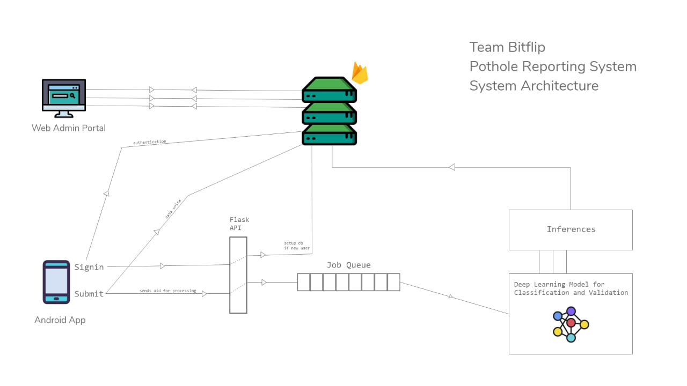

# Plothole - Validator Backend Server 

The backend service has 3 main responsibilities :
* Accept requests from the mobile app
* Add the images on a queue which are fed to the model
* Write the inference results on firebase

## System Design




## Dependencies and Tech Used

* Flask
* Redis and RQ
* Firebase
* Keras and Tensorflow
* Nginx

## Setup Instructions

Running the `setup_server.sh` script will

* download setup redis and rq
* setup nginx
* setup systemctl services
* install all the dependencies

Change the paths in `start.sh` script to properly start rq and the flask server. 

On successfully running `start.sh` the following hapens,

* `Validator` class in `backend/validate.py` is the main link between the model and the server. Have a look at the comments to get an idea.
* On a successful request, the `run_model` function call is queued using `rq` which uses `redis` as a backend.
* The job queue gets successfully executed


## Database Schema

This is the schema of the data stored on firebase which is used by the dashboard component.

```
{
    submissions:{
        uid2: [{
                    gps_coordinates: array[string],
                    image_link: string,
                    status: string
                }, ... ],
        uid2: [],
        uid3: [], ...  
    },

    results: {
        priority_high: [{
                uid: string,
                gps_coordinates: array[string],
                image_link: string,
                validity: float,
                severity: float,
                action_taken: boolean,
                issue_fixed: boolean
        }, ...],
        priority_mid: [{ same as above }],
        priority_low: [{ same as above }],
        priority_verylow: [{ same as above }]
    }
}
// User Submissions keep getting added in the not_processed part
// Once processed they move to the processed part and get added accordingly in 
// the results part
```


## LICENSE
Copyright (c) **Team BitFlip**. All rights reserved. Licensed under the MIT License

[](LICENSE)